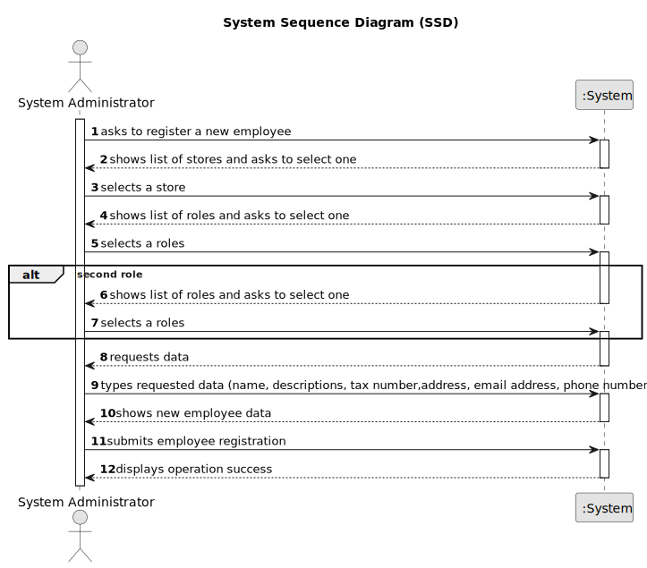

# US 006 - To create a Task 

## 1. Requirements Engineering

### 1.1. User Story Description

As a system administrator, I want to register a new employee.

### 1.2. Customer Specifications and Clarifications 

**From the specifications document:**
The company's systems administrator will be responsible for registering all employees
(specifying the name, descriptions, tax number,address, email address, phone number and the role of the employee) and branches of the network
(specifying the designation, location) as well as preparing the system in order to facilitate the insertion of advertisements and facilitate the use of applications by employees.

**From the client clarifications:**

> **Question:** Can a single employee have more than one role? This is, when a system administrator is
> registering an employee, can he/she select more than one role for that employee or is it limited to
> one role per employee?
>  
> **Answer:**  An employee can have more than one role.

> **Question:** The statement specifies 3 different types of employees. The admnistrator, the agent 
> and the store manager. Do we consider that there are only that functions for employees or are there more?
>
> **Answer:** On this subject everything has already been clarified. Please check the project 
> description and the posts I wrote in this forum.

> **Question:** I have a question related to the output data: when the system administrator
> is registering a new employee are we free to display what we feel is important or should 
> a specific message be shown? I was thinking of displaying whether the operation was successful
> or not, is that fine or should something else be displayed as well?
> 
> **Answer:** A good pratice is to show the information and ask for confirmation.

> **Question:** ou have stated before that name, cc number, tax number, email address, phone number 
> and the assigned agency of the employee are the mandatory requirements to register a new one, 
> leaving out the employee's adress and role. This confused me, because it wasn't clear whether 
> leaving out those two characteristics from the answer was intentional or not. Futhermore, 
> the role of the employee seems like too much of an important piece of information to be left out. 
> My request is, then, for you to state whether or not that was a conscious decision in your answer.
> 
> **Answer:** The role is required

> **Question:** When registering a new employee, all the required data (name, citizen's card number, etc...)
> have to be filled or exists not mandatory data?
> 
> **Answer:**  Required/Mandatory data that should be filled when registering an employee: name, 
> the citizen's card number, the tax number, the email address, the contact telephone number and
> the agency to which it is assigned.

> **Question:** Does the system administrator select the agency to which the employee is assigned and his role from a list
> ? Or does he just type that data
>
> **Answer:** The System Administrator should select

> **Question:** The system administrator cannot add an agent that already exists, the agent has two unique numbers that
> identify him (Tax number and Citizen's card number) which one should be used to identify the agent?
> 
> **Answer:**  The tax number

> **Question:** Must the Tax number and Citizen's card number follow any convention? If so, which?
> 
> **Answer:**  You should use the tax identification number used for tax purposes in the US

> **Question:** Does the System Administrator have permission to create, edit, delete, or just create new employee registrations?
> 
> **Answer:**  For now, the System Administrator can only do what is specified in the Project Requirements.

### 1.3. Acceptance Criteria

* **AC1:** All required fields must be filled in.
* **AC2:** If the store already has a Store Manager, the only role that can be assigned to a new employee is "ROLE_REAL_ESTATE_AGENT".
* **AC3:** When creating a employee with an already existing tax number, the system must reject such operation and the user must have the change to modify the tax number.
* **AC4:** The personal Information must correspond.

### 1.4. Found out Dependencies

* There is a dependency to "US005 Create a store" since at least a store must exist to associate to the employee being created.

### 1.5 Input and Output Data

**Input Data:**

* Typed data:
    * name
    * descriptions
    * tax number
    * address
    * email address
    * phone number
    * password
	
* Selected data:
	* Role of the employee
    * Branch of the network

**Output Data:**
+
* List of existing employees
* List of existing branches
* List of existing roles
* (In)Success of the operation

### 1.6. System Sequence Diagram (SSD)

**Other alternatives might exist.**

#### Alternative One

### 1.7 Other Relevant Remarks

* The created task stays in a "not published" state in order to distinguish from "published" tasks.