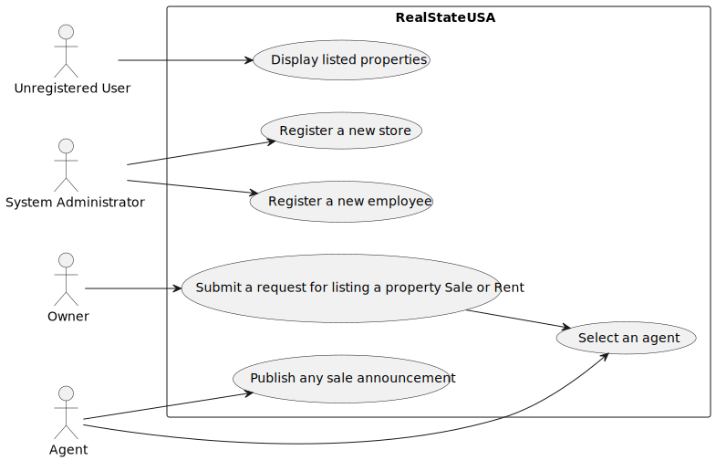

# Use Case Diagram (UCD)

**In the scope of this project, there is a direct relationship of _1 to 1_ between Use Cases (UC) and User Stories (US).**

However, be aware, this is a pedagogical simplification. On further projects and curricular units might also exist _1 to
N **and/or** N to 1 relationship between US and UC.

**Insert below the Use Case Diagram in a SVG format**

**For each UC/US, it must be provided evidences of applying main activities of the software development process (
requirements, analysis, design, tests and code). Gather those evidences on a separate file for each UC/US and set up a
link as suggested below.**

# Use Cases / User Stories

| UC/US | Description                                                                                                                           |                   
|:------|:--------------------------------------------------------------------------------------------------------------------------------------|
| US1   | [As an unregistered user, I want to display listed properties ](../../us001/Readme.md)                                                |
| US2   | [As an agent, I can publish any sale announcement on the system, for example received through a phone call](../../us002/Readme.md)    |
| US3   | [As a system administrator, I want to register a new employee.](../../us003/Readme.md)                                                |
| US4   | [As an owner, I intend to submit a request for listing a property sale or rent,choosing the responsible agent](../../us004/Readme.md) |
| US5   | [As a system administrator, I want to register a store. ](../../us005/Readme.md)                                                      |

