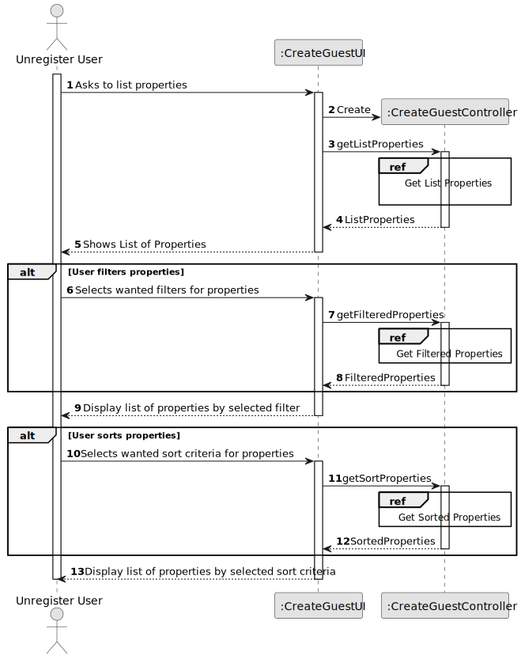
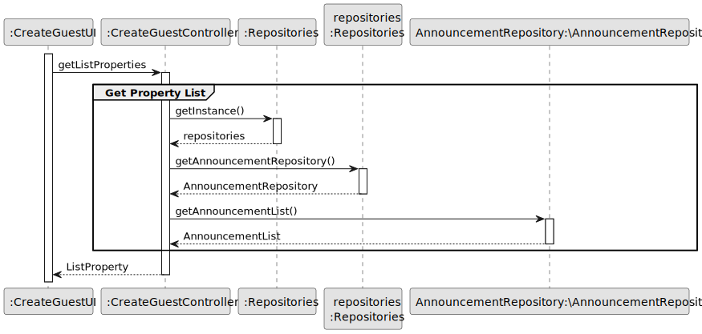
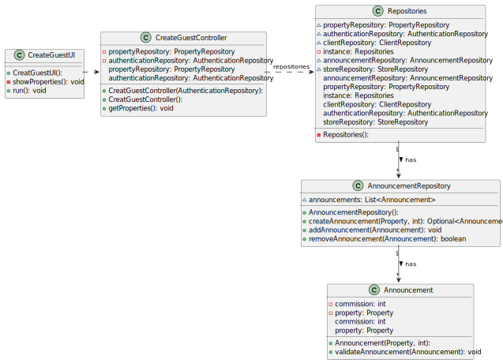

# US 001 - To display listed properties

## 3. Design - User Story Realization 

### 3.1. Rationale

**SSD - Alternative 1 is adopted.**

| Interaction ID | Question: Which class is responsible for...   | Answer                | Justification (with patterns)                                                                                 |
|:---------------|:----------------------------------------------|:----------------------|:--------------------------------------------------------------------------------------------------------------|
| Step 1  		     | 	... interacting with the actor?              | CreateGuestUI         | Pure Fabrication: there is no reason to assign this responsibility to any existing class in the Domain Model. |
| 			  		        | 	... coordinating the US?                     | CreateGuestController | Controller                                                                                                    |
| 			  		        | 	... instantiating a new Task?                | CreatTaskController   | Creator (Rule 1): in the DM Organization has a Task.                                                          |
| 			  		        | ... knowing the user using the system?        | Authenticantion ?     | IE: cf. A&A component documentation.                                                                          |
| Step 2  		     | 	...saving the properties?                    | PropertyRepository    | IE: object created in step 1 has its own data.                                                                |
| Step 3  		     | 	...knowing properties to show?               | CreatGuestUI          | IE: Task Categories are defined by the Administrators.                                                        |
| Step 4  		     | 	... saving the selected filters?             | CreatGuestController  | IE: object created in step 1 is classified in one Category.                                                   |

### Systematization ##

According to the taken rationale, the conceptual classes promoted to software classes are: 

 * PropertyRepository
 * Task

Other software classes (i.e. Pure Fabrication) identified: 

 * CreateGuestUI  
 * CreateGuestController

## 3.2. Sequence Diagram (SD)

### Alternative 1 - Full Diagram

This diagram shows the full sequence of interactions between the classes involved in the realization of this user story.

### Alternative 2 - Split Diagram

This diagram shows the same sequence of interactions between the classes involved in the realization of this user story, but it is split in partial diagrams to better illustrate the interactions between the classes.

It uses interaction ocurrence.

**Get Property List Partial SD**

## 3.3. Class Diagram (CD)

