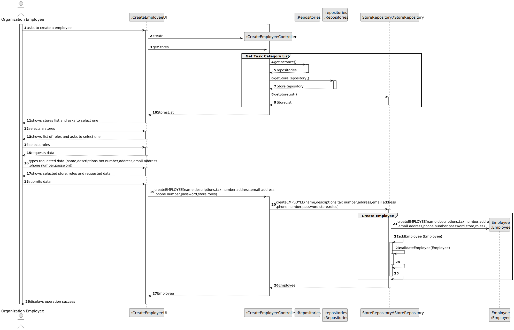
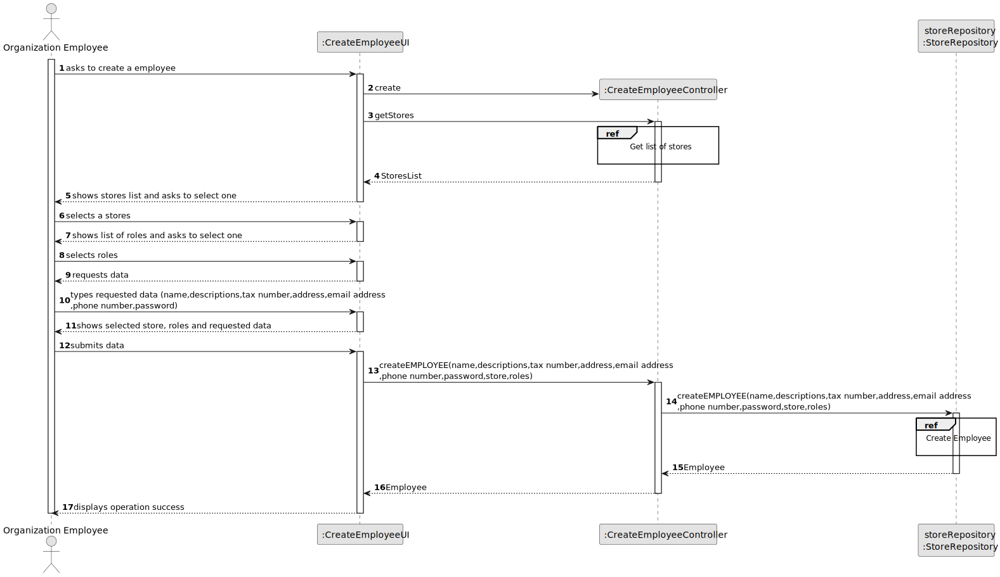
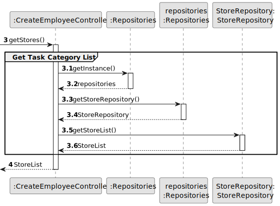
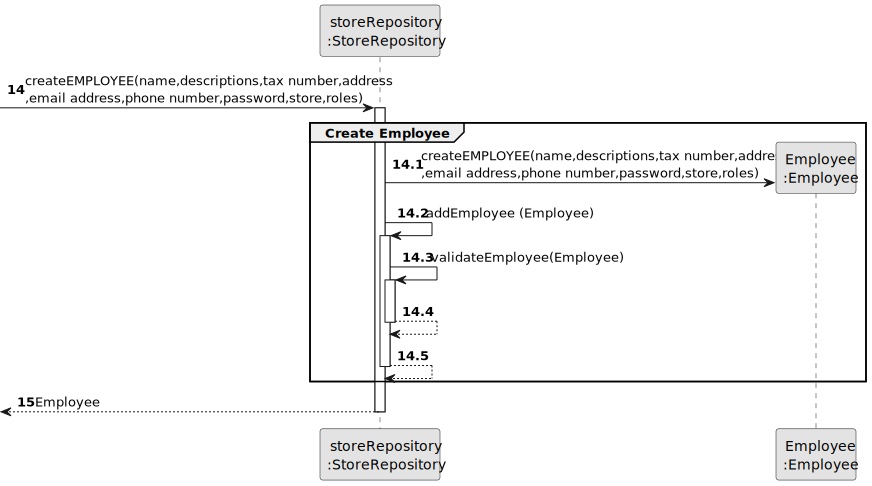
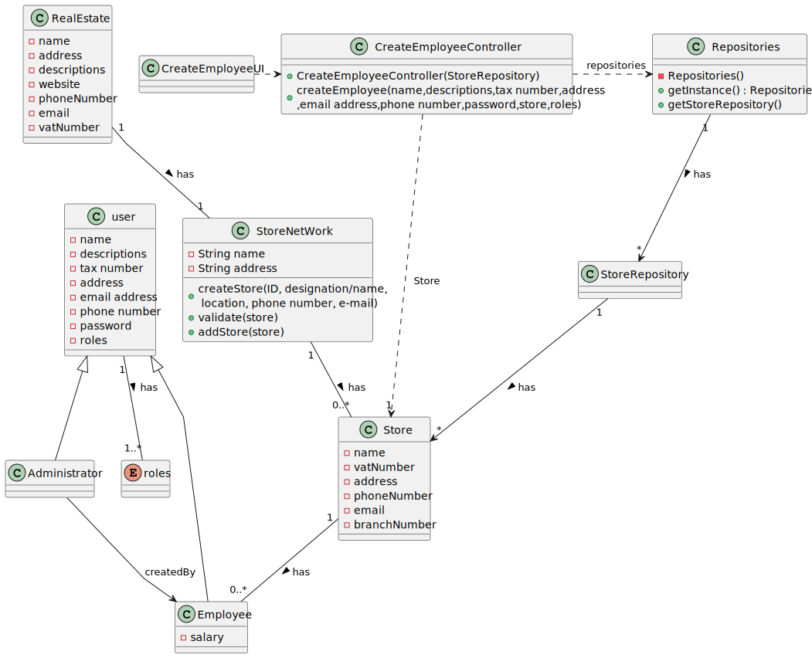

# US 006 - To create a Task 

## 3. Design - User Story Realization 

### 3.1. Rationale

**SSD - Alternative 1 is adopted.**

| Interaction ID | Question: Which class is responsible for...   | Answer                   | Justification (with patterns)                                                                                 |
|:---------------|:----------------------------------------------|:-------------------------|:--------------------------------------------------------------------------------------------------------------|
| Step 1  		     | 	... interacting with the actor?              | CreateEmployeeUI         | Pure Fabrication: there is no reason to assign this responsibility to any existing class in the Domain Model. |
| 			  		        | 	... coordinating the US?                     | CreateEmployeeController | Controller                                                                                                    |
| 			  		        | 	... instantiating a new employee?            | admin                    | Creator (Rule 1): in the DM Store has employee.                                                               |
| Step 3  		     | 	...saving the inputted data?                 | store                    | IE: object created in step 1 has its own data.                                                                |
| Step 4  		     | 	...knowing the task categories to show?      | System                   | IE: employee roles are defined in the class enum roles.                                                       |
| Step 5  		     | 	... saving the selected role?                | employee                 | IE: object created in step 1 is classified in one or more roles.                                              |
| Step 6  		     | 							                                       |                          |                                                                                                               |              
| Step 7  		     | 	... validating all data (local validation)?  | employee                 | IE: owns its data.                                                                                            | 
| 			  		        | 	... validating all data (global validation)? | StoreRepository          | IE: knows all its employee.                                                                                   | 
| 			  		        | 	... saving the created task?                 | StoreRepository          | IE: owns all its employee.                                                                                    | 
| Step 8  		     | 	... informing operation success?             | CreateEmployeeUI         | IE: is responsible for user interactions.                                                                     | 

### Systematization ##

According to the taken rationale, the conceptual classes promoted to software classes are: 

 * StoreRepository
 * employee

Other software classes (i.e. Pure Fabrication) identified: 

 * CreateEmployeeUI  
 * CreateEmployeeController

## 3.2. Sequence Diagram (SD)

### Alternative 1 - Full Diagram

This diagram shows the full sequence of interactions between the classes involved in the realization of this user story.

### Alternative 2 - Split Diagram

This diagram shows the same sequence of interactions between the classes involved in the realization of this user story, but it is split in partial diagrams to better illustrate the interactions between the classes.

It uses interaction ocurrence.

**Get Task Category List Partial SD**

**Get Employee**

**Create Task**

## 3.3. Class Diagram (CD)

