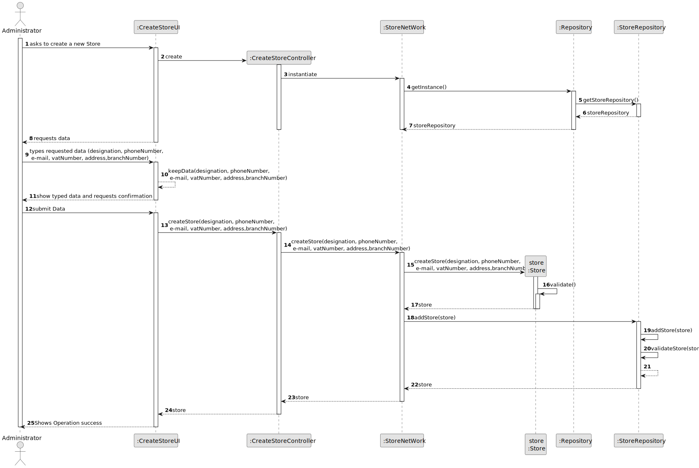

# US 005 - To create a Store 

## 3. Design - User Story Realization 

### 3.1. Rationale

| Interaction ID | Question: Which class is responsible for...   | Answer                | Justification (with patterns)                                                                                 |
|:-------------  |:----------------------------------------------|:----------------------|:--------------------------------------------------------------------------------------------------------------|
| Step 1  		 | 	... interacting with the actor?              | CreateStoreUI         | Pure Fabrication: there is no reason to assign this responsibility to any existing class in the Domain Model. |
| 			  		 | 	... coordinating the US?                     | CreateStoreController | Controller                                                                                                    |
| 			  		 | 	... instantiating a new Store?               | StoreNetwork          | Creator : in the DM StoreNetwork has multiple Sotre                                                           |
| 			  		 | 	... knows store repository?                  | Repository            | Repository knows Store Repository                                                                             |
| 			  		 | ... knowing the user using the system?        | UserSession           | IE: cf. A&A component documentation.                                                                          |
| 			  		 | 							                                       | RealEstate            | IE: knows/has its own Employees                                                                               |
| 			  		 | 							                                       | Employee              | IE: knows its own data (e.g. email)                                                                           |
| Step 2  		 | 							                                       |                       |                                                                                                               |
| Step 3  		 | 	...saving the inputted data?                 | Store                 | IE: object created in step 1 has its own data.                                                                |
| Step 6  		 | 							                                       |                       |                                                                                                               |              
| Step 7  		 | 	... validating all data (local validation)?  | Store                 | IE: owns its data.                                                                                            | 
| 			  		 | 	... validating all data (global validation)? | StoreRepository       | IE: knows all its Stpre.                                                                                      | 
| 			  		 | 	... saving the created Store?                | StoreRepository       | IE: owns all its Store.                                                                                       | 
| Step 8  		 | 	... informing operation success?             | CreateStoreUI         | IE: is responsible for user interactions.                                                                     | 

### Systematization ##

According to the taken rationale, the conceptual classes promoted to software classes are: 

 * StoreNetwork
 * Store

Other software classes (i.e. Pure Fabrication) identified: 

 * CreateStoreUI  
 * CreateStoreController

## 3.2. Sequence Diagram (SD)

### Alternative 1 - Full Diagram

This diagram shows the full sequence of interactions between the classes involved in the realization of this user story.

## 3.3. Class Diagram (CD)

