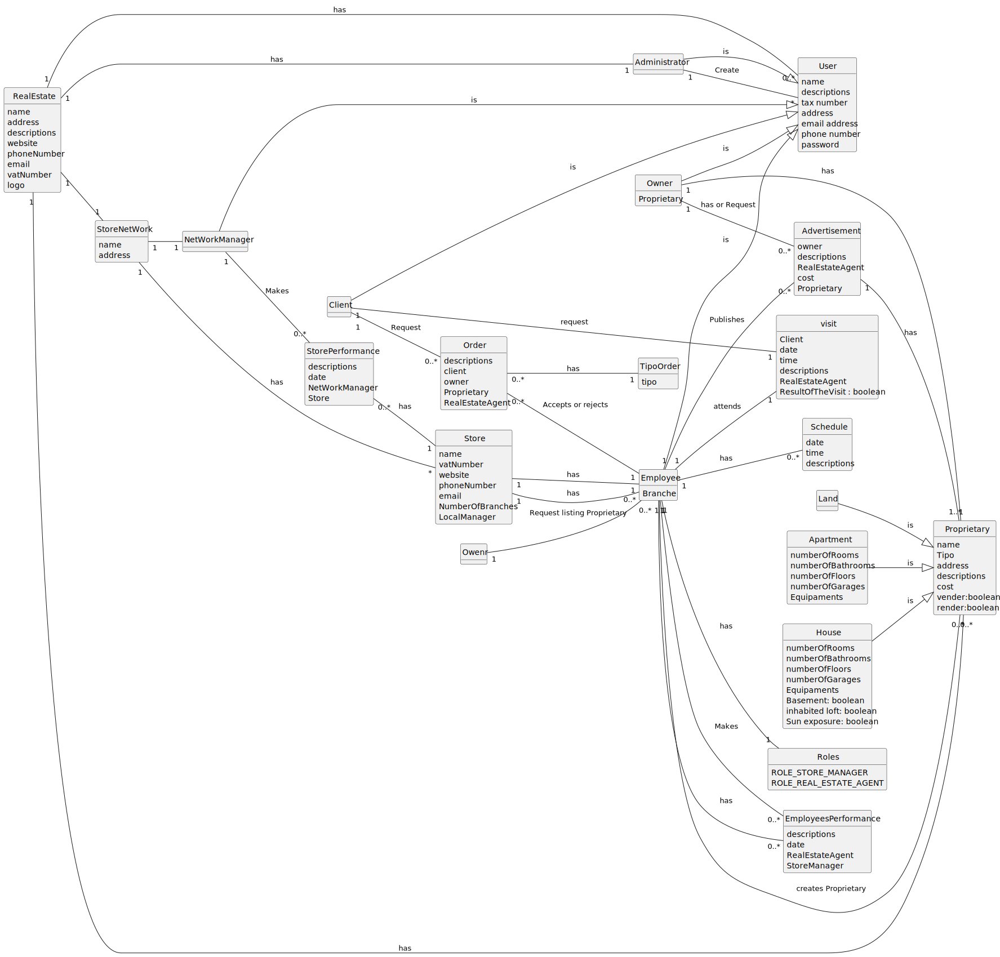

# Analysis

The construction process of the domain model is based on the client specifications, especially the nouns (for
_concepts_) and verbs (for _relations_) used.

## Rationale to identify domain conceptual classes ##

To identify domain conceptual classes, start by making a list of candidate conceptual classes inspired by the list of
categories suggested in the book "Applying UML and Patterns: An Introduction to Object-Oriented Analysis and Design and
Iterative Development".

### _Conceptual Class Category List_ ###

**Business Transactions**

* Property Sales
* Setting of the property rental commission
* Request a property tour by a client
* Request a pruchase or lease of a property by a client

---

**Transaction Line Items**

* Property Description
* Property Price
* Property Adress
* Property buying/leasing conditions
* 

---

**Product/Service related to a Transaction or Transaction Line Item**

* The properties that are being sold/leased.
* Property tour
* Property advertisement

---

**Transaction Records**

* Records of buying/leasing requests
* Records of property tours
* Records of property advertisements
* Records of property sales/leases

---  

**Roles of People or Organizations**

* Role
* Agent
* Owner
* Administrator
* StoreManager
* Employee
* Real Estate Agent

---

**Places**

* Adress of the properties
* Store

---

**Noteworthy Events**

* Closing the deal about the property sale/lease
* Visit Schedule
* 

---

**Physical Objects**

* Property
* Equipment
* Land
* House
* Apartment

---

**Descriptions of Things**

* Description of the properties

---

**Catalogs**

* List of properties for sale/lease
* List of property tours

---

**Containers**

* Store
* Real estate agency
* Property

---

**Elements of Containers**

* Individual Real Estate Agency
* Real estate agents assigned to a specific store
* Properties assigned to a specific store

---

**Organizations**

* Real Estate
* Store Network

---

**Other External/Collaborating Systems**

* None

---

**Records of finance, work, contracts, legal matters**

* Purchase/Lease contracts

---

**Financial Instruments**

* None

---

**Documents mentioned/used to perform some work/**

* Property photos
* 

---

###**Rationale to identify associations between conceptual classes**###

An association is a relationship between instances of objects that indicates a relevant connection and that is worth of
remembering, or it is derivable from the List of Common Associations:

+ **_A_** is physically or logically part of **_B_**
+ **_A_** is physically or logically contained in/on **_B_**
+ **_A_** is a description for **_B_**
+ **_A_** known/logged/recorded/reported/captured in **_B_**
+ **_A_** uses or manages or owns **_B_**
+ **_A_** is related with a transaction (item) of **_B_**
+ etc.

| Concept (A) 		  |       Association   	       |       Concept (B) |
|-----------------|:---------------------------:|------------------:|
| Store   	       |          has  		 	          |          Employee |
| Store	          |         has    		 	         | Store Performance |
| Store           |             has             |     Store Network |
| Store Network   |          employees          |   Network Manager |
| Network Manager |            makes            | Store Performance |
| Employee        |             has             |             Roles |
| Employee        |             has             |          Schedule |
| Employee        |       accepts/rejects       |             Order |
| Employee        |           attends           |             Visit |
| Employee        |             is              |              User |
| Employee        |          publishes          |     Advertisement |
| Owner           |             is              |              User |
| Owner           |             has             |     Advertisement |
| Owner           | requests listing properties |          Employee |
| Owner           |             has             |          Property |
| Real Estate     |             has             |     Administrator |
| Real Estate     |             has             |          Property |
| Client          |             is              |              User |
| Client          |          requests           |             Order |
| Client          |          requests           |             Visit |
| Land            |             is              |          Property |
| House           |             is              |          Property |
| Apartment       |             is              |          Property |
| Administrator   |             is              |              User |
| User            |           creates           |     Administrator |

## Domain Model

**Do NOT forget to identify concepts atributes too.**

**Insert below the Domain Model Diagram in a SVG format**

