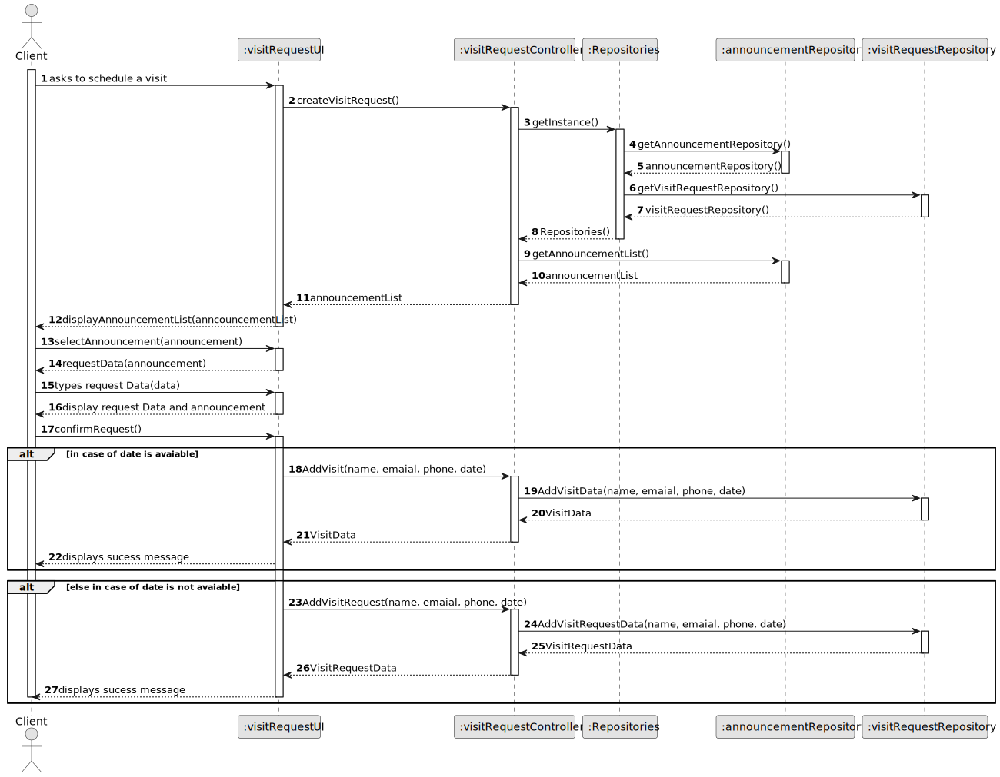
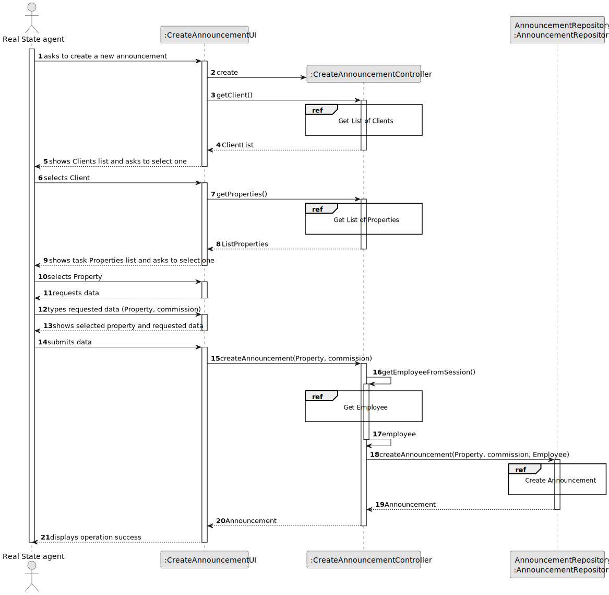
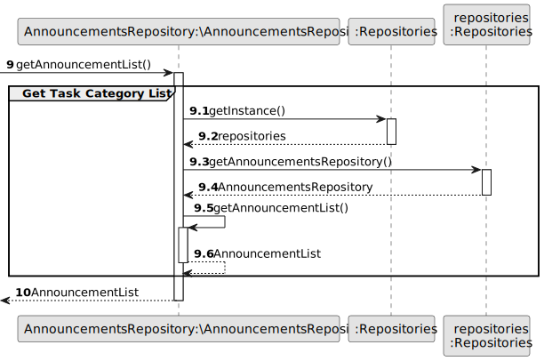
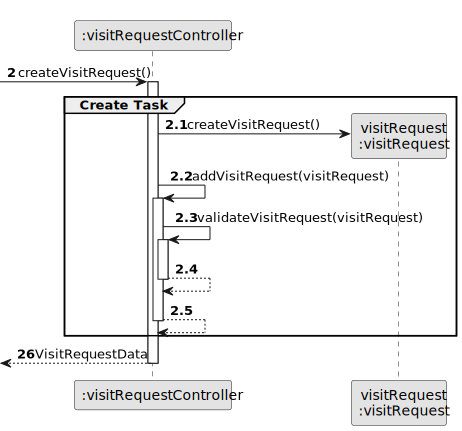
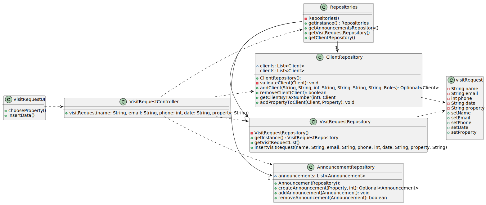

# US 009 - To create a Task

## 3. Design - User Story Realization

### 3.1. Rationale

**SSD - Alternative 1 is adopted.**

| Interaction ID | Question: Which class is responsible for...    | Answer                  | Justification (with patterns)                                                                                 |
|:---------------|:-----------------------------------------------|:------------------------|:--------------------------------------------------------------------------------------------------------------|
| Step 1         | 	... interacting with the actor?               | CreateRequestUI         | Pure Fabrication: there is no reason to assign this responsibility to any existing class in the Domain Model. |
| Step 2	  		    | 	... coordinating the US?                      | CreateRequestController | Controller                                                                                                    |
| Step 3	  		    | 	... instantiating a new Request?              | Client                  | Creator (Rule 1): The Request has a Announcement that belongs to an Client.                                   |
| Step 4			  		  | ... knowing the ListOfClients to show?         | ClientRepository        | IE: knows all its Clients.                                                                                    |
| Step 5	  		    | 	... saving the selected Client 						         | employee                | IE:  object created in step 3 is classified in one or more roles.                                             |
| Step 6		       | 	... knowing the ListOfRequests to show? 					 | VisitRequestRepository  | IE: knows all its Requests.                                                                                   |
| Step 7  		     | 		... saving the selected Announcement		       | Client                  | IE: object created in step 3 is classified in one or more roles.                                              |
| Step 8  		     | 	... knowing the commission?                   | AnnouncementRepository  | IE: knows all its Announcements.                                                                              |
| Step 9  		     | 	... saving the inputted commission            | employee                | IE: object created in step 1 is classified in one or more roles.                                              |
| Step 10  		    | 	... validating all data (local validation)?   | employee                | IE: owns its data.                                                                                            |
| Step 11 		     | 		... validating all data (global validation)? | AnnouncementRepository  | IE: knows all its announcements.                                                                              |              
| Step 12  		    | 	... saving the created Announcement?          | AnnouncementRepository  | IE: owns all its data.                                                                                        | 
| 			  		        | 	... informing operation success?              | CreateRequesttUI        | IE: is responsible for user interactions.                                                                     |

### Systematization ##

According to the taken rationale, the conceptual classes promoted to software classes are:

* AnnouncementRepository
* Announcement
* VisitRequestRepository
* VisitRequest

Other software classes (i.e. Pure Fabrication) identified:

* CreateVisitRequestUI
* CreateVisitRequestController

## 3.2. Sequence Diagram (SD)

### Alternative 1 - Full Diagram

This diagram shows the full sequence of interactions between the classes involved in the realization of this user story.

### Alternative 2 - Split Diagram

This diagram shows the same sequence of interactions between the classes involved in the realization of this user story,
but it is split in partial diagrams to better illustrate the interactions between the classes.

It uses interaction ocurrence.

**Get Announcement List**

**Create Visit Request**

## 3.3. Class Diagram (CD)

