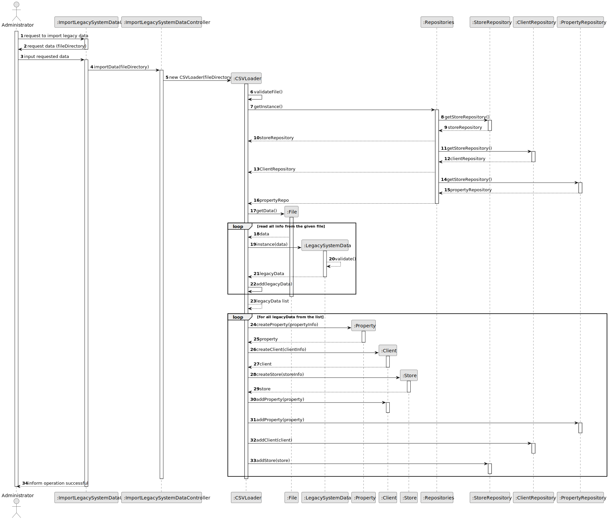

# US 005 - As a system administrator, I want to import information from a legacy system that has been in use in several agencies.

## 3. Design - User Story Realization 

### 3.1. Rationale

| Interaction ID | Question: Which class is responsible for...   | Answer                           | Justification (with patterns)                                                                                 |
|:-------------  |:----------------------------------------------|:---------------------------------|:--------------------------------------------------------------------------------------------------------------|
| Step 1  		 | 	... interacting with the actor?              | ImportLegacySystemDataUI         | Pure Fabrication: there is no reason to assign this responsibility to any existing class in the Domain Model. |
| 			  		 | 	... coordinating the US?                     | ImportLegacySystemDataController | Controller                                                                                                    |
| 			  		 | 	... instantiating a LegacySystemData?        | CSVLoader                        | Creator : to instanciate legacy system data                                                                   |
| 			  		 | 	... knows datas of property/clietn/store?    | LegacySystemData                        | IE: knows all informations to instanciate new calsses                                                         |
| 			  		 | 	... knows all repositories?                  | Repositories                     | Repository knows Store Repository                                                                             |
| 			  		 | ... knowing the user using the system?        | UserSession                      | IE: cf. A&A component documentation.                                                                          |
| 			  		 | 							                                       | Admin                            | IE: knows its own data (e.g. email)                                                                           |
| Step 2  		 | 							                                       |                                  |                                                                                                               |
| Step 3  		 | 	...saving the inputted data?                 | CSVLoader                            | IE: object created in step 1 has its own data.                                                                |
| Step 6  		 | 	...instanciate property/client/store						   |       CSVLoader                           |                                                                                                               |              
| Step 7  		 | 	... validating all data (local validation)?  | LegacySystemData                            | IE: owns data to instanciate new classes.                                                                     | 
| 			  		 | 	... validating all data (global validation)? | CSVLoader                  | IE: knows all LegacySystemData.                                                                               | 
| 			  		 | 	... saving the created Store?                | Repositories                  | IE: owns all repositories.                                                                                    | 
| Step 8  		 | 	... informing operation success?             | CreateStoreUI                    | IE: is responsible for user interactions.                                                                     | 

### Systematization ##

According to the taken rationale, the conceptual classes promoted to software classes are: 

 * CSVLoader
 * LegacySystemData

Other software classes (i.e. Pure Fabrication) identified: 

 * ImportLegacySystemDataUI  
 * ImportLegacySystemDataController

## 3.2. Sequence Diagram (SD)

### Alternative 1 - Full Diagram

This diagram shows the full sequence of interactions between the classes involved in the realization of this user story.

## 3.3. Class Diagram (CD)

