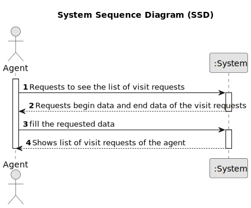

# US 006 - To create a Task 

## 1. Requirements Engineering

### 1.1. User Story Description

As an agent, I intend to see the list of Visit requests made to myself

### 1.2. Customer Specifications and Clarifications 

**From the specifications document:**
An agent views Visit requests

**From the client clarifications:**

> **Question:** The US15 does the listing and in US16 we are already responsing to one booking request. That said, were is the selection part being done?
> 
> **Answer:** In US15 the Agent gets a list of booking requests (made to him). Then, the agent, may want to respond to 
> the user (as defined in US16). US15 and US16 are executed sequentially. Even so, the agent should be able to see a list
> of all booking requests made to him (US15) without answer any booking request. In US16 the agent selects the booking request.

> **Question:**One of our questions' answers made us believe there might have been some miscommunication, as it had some significant
> mistakes in phrasing and your answer wasn't clear enough. As such, here is that same question, in a simpler and clearer way:
>US017's AC2 states that "Two sorting algorithms should be implemented (to be chosen manually by the network manager)."
>US015's AC2 states that "The list of requests must be sorted by date in ascending order. The sorting algorithm to be used 
> by the application must be defined through a configuration file. At least two sorting algorithms should be available."
>As such, the team would like to know if, just like in US017, the sorting methods would be chosen manually in US01
> 
> **Answer:** In US 15 the sorting algorithm to be used by the application must be defined through a configuration file.
> This is a diferent strategy from what I want in US17. Please study ESOFT.

 
### 1.3. Acceptance Criteria

* **AC1:** The list of requests must be shown for a specific period (begin date, end date).
* **AC2:** The list of requests must be sorted by date in ascending order. The sorting algorithm to be used by the application must be defined through a configuration file. At least two sorting algorithms should be available.

### 1.4. Found out Dependencies

* The agent have to be logged in the system to see the list of booking requests.
* it is necessary to have a list of booking requests to respond to a booking request.

### 1.5 Input and Output Data

**Input Data:**

* Typed data:
  begin date
  end date

**Output Data:**
+
* List of booking requests.
* 
### 1.6. System Sequence Diagram (SSD)

#### Alternative One

### 1.7 Other Relevant Remarks
