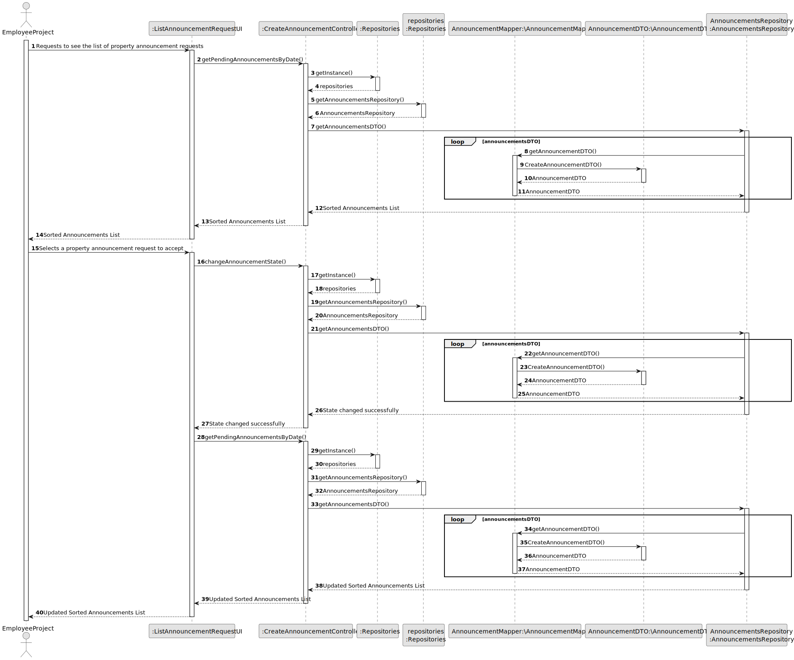
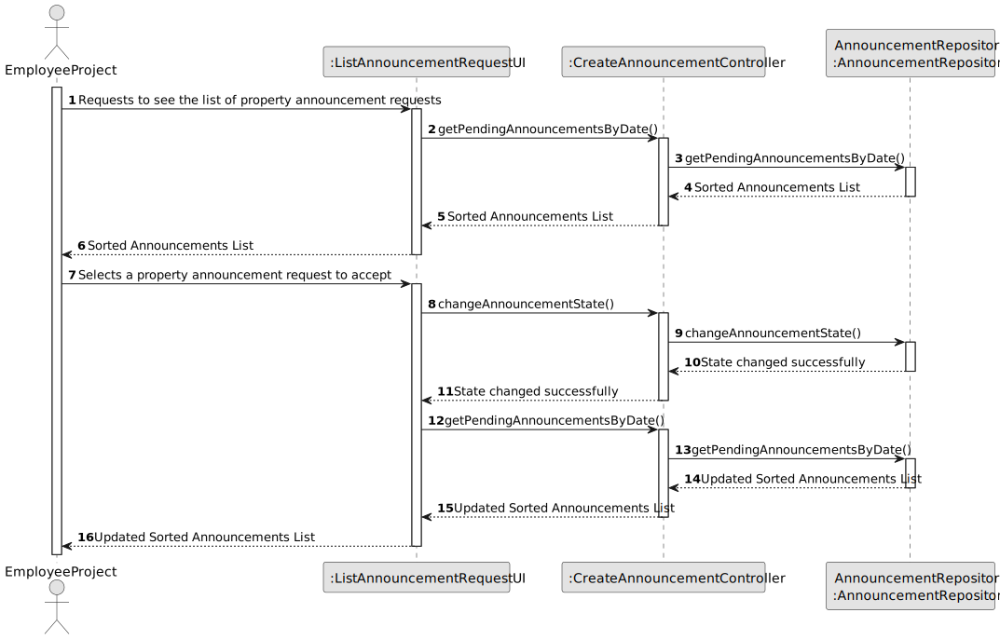
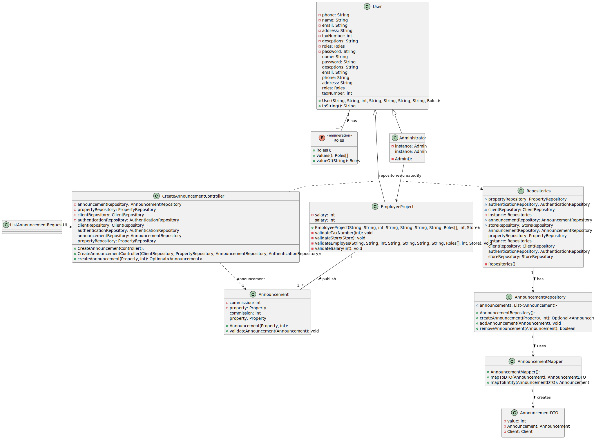

# US 008 - As an agent, I intend to see the list of property announcement requests made to myself, so that I can post the announcement.

## 3. Design - User Story Realization 

### 3.1. Rationale

**SSD - Alternative 1 is adopted.**

| Interaction ID | Question: Which class is responsible for...              | Answer                       | Justification (with patterns)                                                                                 |
|:---------------|:---------------------------------------------------------|:-----------------------------|:--------------------------------------------------------------------------------------------------------------|
| Step 1  		     | 	... interacting with the actor?                         | ListAnnouncementUI           | Pure Fabrication: there is no reason to assign this responsibility to any existing class in the Domain Model. |
| Step 2	        | 	... coordinating the US?                                | CreateAnnouncementController | Controller                                                                                                    |
| Step 3  		     | 	...knowing the getPendingAnnouncementsByDate to show?   | AnnouncementRepository       | IE: knows pending announcements by date                                                                       |
| Step 4  		     | 	... saving the selected Announcement?        | Announcement                 | IE: object created in step 1 is classified in one or more roles.                                              |
| Step 5	  		    | 	Returning the announcements in a DTO ?       | Mapper                 | Class created with that objective and know all it methods of creation                                         |
| Step 6  		     | 	... changing selected Announcement state?               | employee                     | IE: object created in step 1 is classified in one or more roles.                                              |
| Step 7  		     | 	...knowing the getPendingAnnouncementsByDate refreshed? | AnnouncementRepository       | IE: knows pending announcements by date                                                                       |
| Step 8  		     | 	... informing operation success?                        | ListAnnouncementUI           | IE: is responsible for user interactions.                                                                     |

### Systematization ##

According to the taken rationale, the conceptual classes promoted to software classes are: 

 * AnnouncementRepository
 * Announcement

Other software classes (i.e. Pure Fabrication) identified: 

 * ListAnnouncementUI  
 * CreateAnnouncementController

## 3.2. Sequence Diagram (SD)

### Alternative 1 - Full Diagram

This diagram shows the full sequence of interactions between the classes involved in the realization of this user story.

### Alternative 2 - Split Diagram

This diagram shows the same sequence of interactions between the classes involved in the realization of this user story, but it is split in partial diagrams to better illustrate the interactions between the classes.

It uses interaction ocurrence.

**Get Announcements**

## 3.3. Class Diagram (CD)

