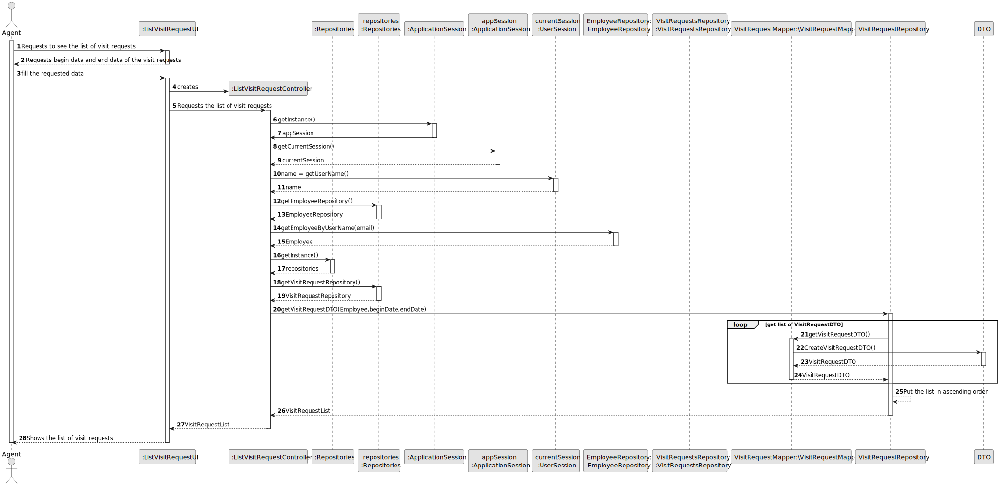
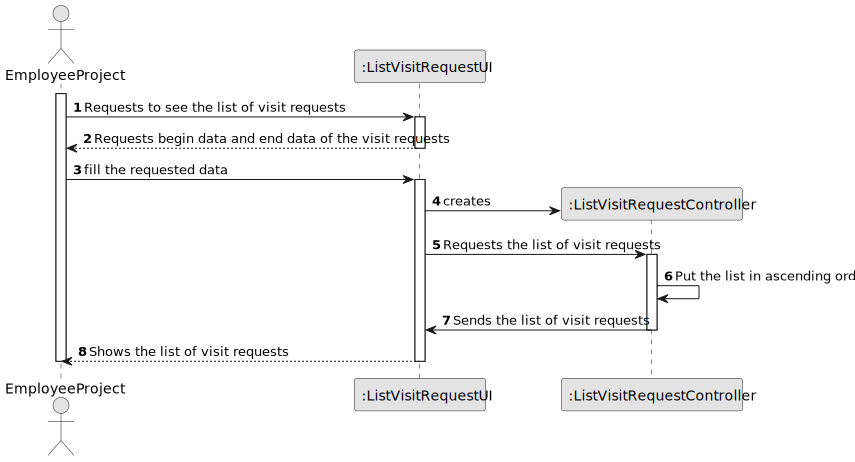
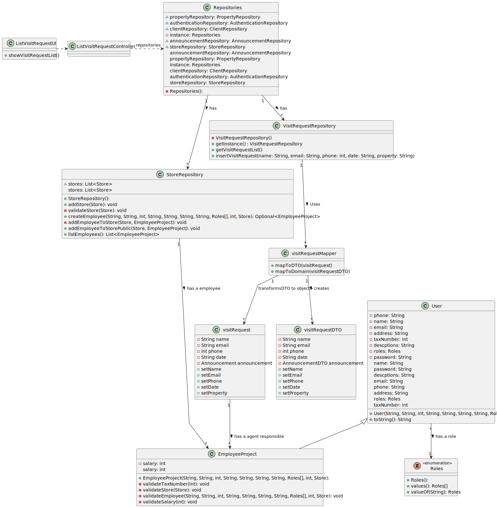

# US 008 - As an agent, I intend to see the list of property announcement requests made to myself, so that I can post the announcement.

## 3. Design - User Story Realization 

### 3.1. Rationale

**SSD - Alternative 1 is adopted.**

| Interaction ID | Question: Which class is responsible for...    | Answer                        | Justification (with patterns)                                                                                 |
|:---------------|:-----------------------------------------------|:------------------------------|:--------------------------------------------------------------------------------------------------------------|
| Step 1  		     | 	... interacting with the actor?               | MessageVisitRequestUI         | Pure Fabrication: there is no reason to assign this responsibility to any existing class in the Domain Model. |
| 			  		        | 	... coordinating the US?                      | MessageVisitRequestController | Controller                                                                                                    |
| Step 2  		     | 	...knowing the ListOfVisitingRequest to show? | VisitRequestRepository        | IE: knows all its VisitRequest                                                                                |
| Step 3  		     | 	... showing ListOfVisitingRequest?            | MessageVisitRequestUI         | IE: is responsible for user interactions.                                                                     |

### Systematization ##

According to the taken rationale, the conceptual classes promoted to software classes are: 

 * VisitRequestRepository
 * VisitRequest

Other software classes (i.e. Pure Fabrication) identified: 

* CreateVisitRequestUI
* CreateVisitRequestController

## 3.2. Sequence Diagram (SD)

### Alternative 1 - Full Diagram

This diagram shows the full sequence of interactions between the classes involved in the realization of this user story.

### Alternative 2 - Split Diagram

This diagram shows the same sequence of interactions between the classes involved in the realization of this user story, but it is split in partial diagrams to better illustrate the interactions between the classes.

It uses interaction ocurrence.

**Get Announcements**

## 3.3. Class Diagram (CD)

