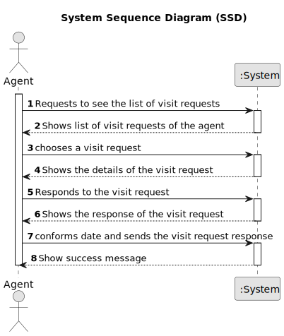

# US 016 - Respond to scheduling a visit of a property

## 1. Requirements Engineering

### 1.1. User Story Description

> As an agent, I want to be able to respond to a client's request to schedule a visit to a property

### 1.2. Customer Specifications and Clarifications 

**From the specifications document:**

> The agent will be responsible to respond the message

**From the client clarifications:**

> **Question:** Regarding the AC4, it is stated "The response should include the property identification and location.".
> Is the property identification the same as the location? If not, how should we handle it in the legacy file since there
> isn't a specific column for each?
>
> **Answer:** The response should include only the property location.
> US16 is not related with the legacy file!!! I think you have to study a little more ESOFT

> **Question:** The US15 does the listing and in US16 we are already responsing to one booking request. That said, were is the selection part being done?
>
> **Answer:**  In US15 the Agent gets a list of booking requests (made to him). Then, the agent, may want to respond to
> the user (as defined in US16). US15 and US16 are executed sequentially. Even so, the agent should be able to see a list
> of all booking requests made to him (US15) without answer any booking request. In US16 the agent selects the booking request

> **Question:** When the agent requests the booking requests list to contact the client, that list should ONLY contain the requests related to that agent?
> 
> **Answer:** Yes. Listing is a feature described in US15.
> Important: In US15 the Agent gets a list of booking requests (made to him). Then, the agent, may want to respond to the 
> user (as defined in US16). US15 and US16 are executed sequentially. Even so, the agent should be able to see a list of all 
> booking requests made to him (US15) without answer any booking request.> **Question:** When the agent requests the booking requests list to contact the client, that list should ONLY contain the requests related to that agent?

> **Question:** When the agent is responding to the user that created the request, what should the answer be? Because accepting or declining the request is already done in US011.
>
> **Answer:** Yes. Listing is a feature described in US15.
Important:  In US11 the agent wants to accept or decline a purchase order for a property. In US16 the agent wants to answer visit requests.
>Please discuss the requirements with your team and professors before making a question.

### 1.3. Acceptance Criteria

* **AC1:** The response is sent by email
* **AC2:** Different email services can send the message. These services must be
  configured using a configuration file to enable using different platforms (e.g.:
  gmail, DEI's email service, etc.)
* **AC3:** The response should include the name and phone number of the responsible Agent
* **AC4:** The response should include the property identification and location
* **AC5:** When an Agent responds to a booking request the list of booking requests should be updated to not show this request.
### 1.4. Found out Dependencies

* The agent have to be logged in the system to respond a schedule visit.
* The agent have to be logged in the system to see the list of booking requests.
* it is necessary to have a list of booking requests to respond to a booking request.

### 1.5 Input and Output Data

**Input Data:**

* Typed data:
	* response to the booking request

* Selected data:
    * Select Visit Request

**Output Data:**

* Display confirmation message

### 1.6. System Sequence Diagram (SSD)

**Other alternatives might exist.**

#### Alternative One

### 1.7 Other Relevant Remarks

