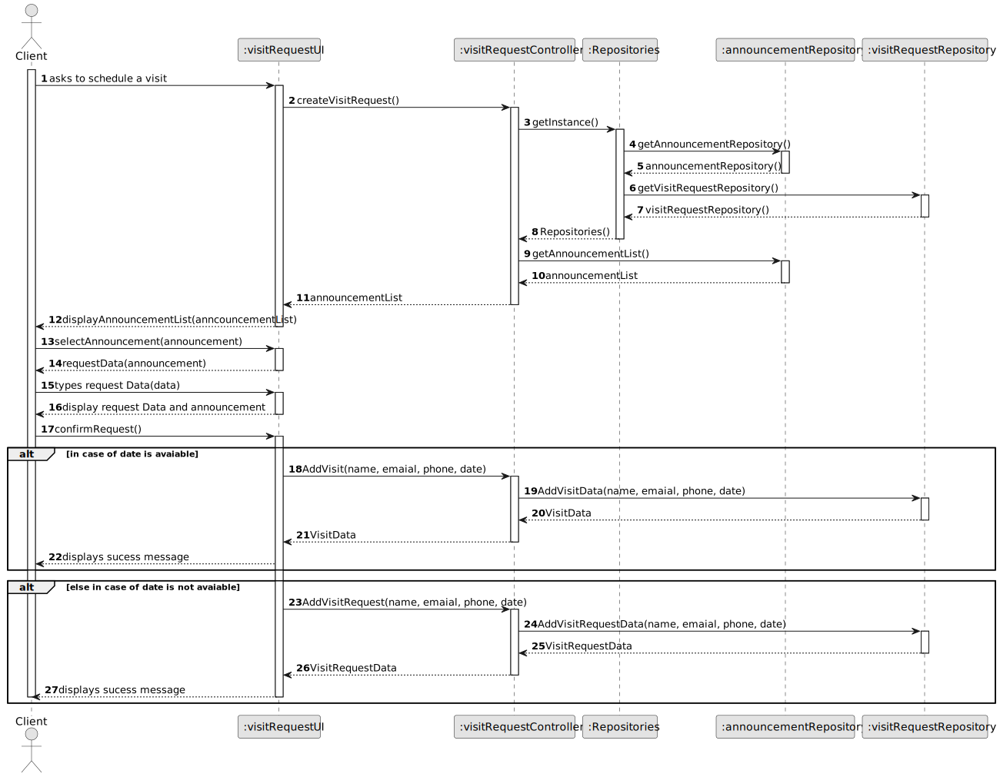
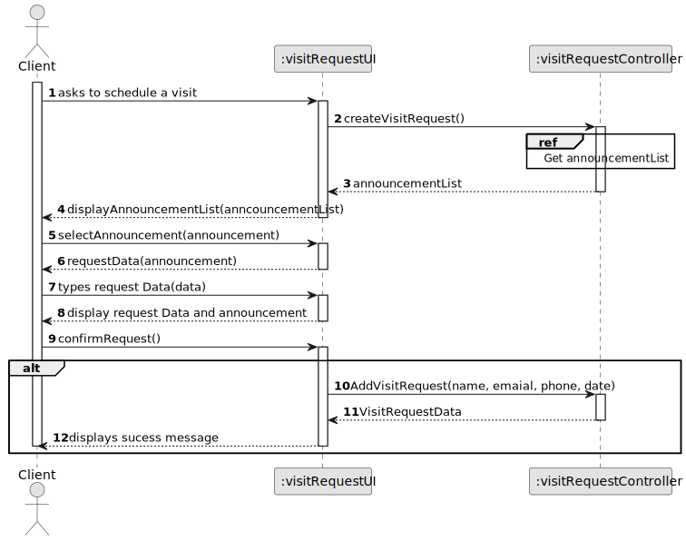
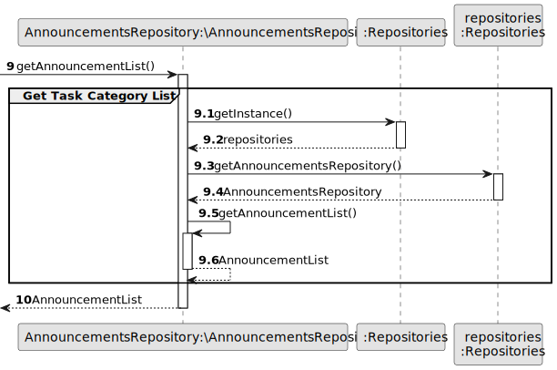
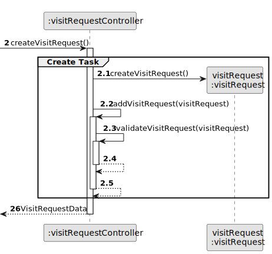
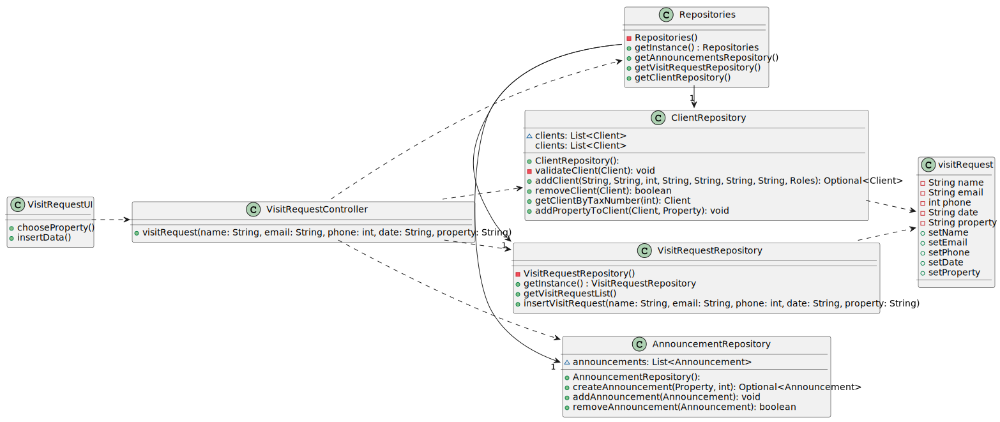

# US 009 - To create a Task

## 3. Design - User Story Realization

### 3.1. Rationale

**SSD - Alternative 1 is adopted.**

| Interaction ID | Question: Which class is responsible for...   | Answer                 | Justification (with patterns)                                                                                 |
|:---------------|:----------------------------------------------|:-----------------------|:--------------------------------------------------------------------------------------------------------------|
| Step 1  		     | 	... interacting with the actor?              | CreateOrderUI          | Pure Fabrication: there is no reason to assign this responsibility to any existing class in the Domain Model. |
| 			  		        | 	... coordinating the US?                     | CreateOrderController  | Controller                                                                                                    |
| 			  		        | 	... instantiating a new order?               | client                 | Creator (Rule 1): in the DM client has order.                                                                 |
| Step 2  		     | 	...knowing the ListOfAnnouncements to show?  | AnnouncementRepository | IE: knows all its Announcements                                                                               |
| Step 3  		     | 	... saving the selected Announcement?        | order                  | IE: object created in step 1 is classified in one or more roles.                                              |
| 			  		        | 	Returning the announcements in a DTO ?       | Mapper                 | Class created with that objective and know all it methods of creation                                         |
| Step 3  		     | 	... saving the selected Announcement?        | order                  | IE: object created in step 1 is classified in one or more roles.                                              |
| Step 4  		     | 	...knowing the Client login?                 | AnnouncementRepository | IE: knows all the credentials and who is login in the moment                                                  |
| Step 5  		     | 	... saving the selected client?              | order                  | IE: object created in step 1 is classified in one or more roles.                                              |
| Step 6  		     | 							                                       |                        |                                                                                                               |              
| Step 7  		     | 	... validating all data (local validation)?  | order                  | IE: owns its data.                                                                                            | 
| 			  		        | 	... validating all data (global validation)? | OrderRepository        | IE: knows all its orders.                                                                                     | 
| 			  		        | 	... saving the created task?                 | OrderRepository        | IE: owns all its orders.                                                                                      | 
| Step 9  		     | 	... informing operation success?             | CreateOrderUI          | IE: is responsible for user interactions.                                                                     |
| Step 10  		    | 	... informing operation success?             | CreateOrderUI          | IE: is responsible for user interactions.                                                                     | 

### Systematization ##

According to the taken rationale, the conceptual classes promoted to software classes are:

* AnnouncementRepository
* Announcement
* VisitRequestRepository
* VisitRequest

Other software classes (i.e. Pure Fabrication) identified:

* CreateVisitRequestUI
* CreateVisitRequestController

## 3.2. Sequence Diagram (SD)

### Alternative 1 - Full Diagram

This diagram shows the full sequence of interactions between the classes involved in the realization of this user story.

### Alternative 2 - Split Diagram

This diagram shows the same sequence of interactions between the classes involved in the realization of this user story,
but it is split in partial diagrams to better illustrate the interactions between the classes.

It uses interaction ocurrence.

**Get Announcement List**

**Create Visit Request**

## 3.3. Class Diagram (CD)

