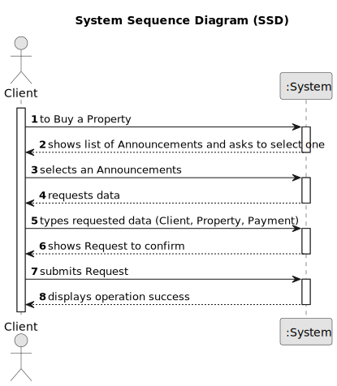

# US17: As a network manager, I want to list all deals made. 

## 1. Requirements Engineering

### 1.1. User Story Description

As a network manager, I want to list all deals made.

### 1.2. Customer Specifications and Clarifications 

**From the client clarifications:**

> **Question:** In US10, can the client remove an offer they made at any point, 
> in order to replace it with a different one?
>  
> **Answer:**   No.

> **Question:** When showing the other order on the screen, what data should be shown 
> (eg client name, published date, order status)?
>
> **Answer:**If the order amount submitted by the client has already been posted for the property
> (by another request from this client or any other client), the system must state that on the screen.
> The system should show the message "The order amount submitted has already been posted for this property.
> Please contact the agent that is responsible for this property.".

> **Question:** To order a purchase of a property, should the client be able to filter the properties by type
> of property, city, district....so that it's easier to find the wanted property, or should the system show 
> the entire list of properties to sale?
> 
> **Answer:** The system should show a list of properties to the client. Filtering is a useful feature 
> of the system, please prepare a user friendly and effective filtering to show the properties to the client.

> **Question:** Should this User Story be implemented as an addition to US001 (Users can display properties, 
> and select one to make an order), or should it be completely separate, with a separate section of the app 
> dedicated to it?
> 
> **Answer:** To place an order the actor should be registered in the system.

> **Question:**When the client intends to place a purchase order, should the list of properties (announcements)
> be presented initially and then asked to select a property?
> 
> **Answer:**  The system should show a list of properties to the client.

> **Question:** What data is required, in addition to the order value, so that a client can place an
> order to purchase a property?
>
> **Answer:** Only the order amount.

### 1.3. Acceptance Criteria

* **AC1:** The actor should be able to sort all properties by property area (square feet)
  in descending/ascending order.
* **AC2:** Two sorting algorithms should be implemented (to be chosen manually by
  the network manager).
* **AC3:**  Worst-case time complexity of each algorithm should be documented in the
  application user manual that must be delivered with the application (in the
  annexes, where algorithms should be written in pseudocode).
### 1.4. Found out Dependencies

* There is a dependency that a client must already exist in the system in order 
to create a new order, it must also exit already a announcement.

### 1.5 Input and Output Data

**Input Data:**

* Typed data:
    * value
	
* Selected data:
	* announcement
  
 * Data Provided by the System:
   * Client

**Output Data:**
+
* List of existing announcements
* (In)Success of the operation

### 1.6. System Sequence Diagram (SSD)

**Other alternatives might exist.**

#### Alternative One

### 1.7 Other Relevant Remarks

* The order is set to pending by default.