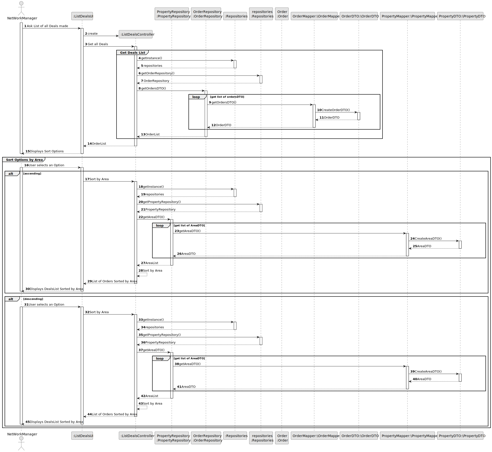

# US 017 - To List all Deals

## 3. Design - User Story Realization 

### 3.1. Rationale

**SSD - Alternative 1 is adopted.**

| Interaction ID | Question: Which class is responsible for... | Answer              | Justification (with patterns)                                                                                 |
|:---------------|:--------------------------------------------|:--------------------|:--------------------------------------------------------------------------------------------------------------|
| Step 1  		     | 	... interacting with the actor?            | ListDealsUI         | Pure Fabrication: there is no reason to assign this responsibility to any existing class in the Domain Model. |
| 			  		        | 	... coordinating the US?                   | ListDealsController | Controller                                                                                                    |
| 			  		        | 	... instantiating a new Task?              | network manager     | Creator                                                                  |
| Step 2  		     | 	...knowing the ListofOrders to show?       | OrderRepository     | IE: knows all its Orders                                                                                      |
| Step 3  		     | 		...knowing the AreaList to show?          | PropertyRepository  | IE: knows all properties and areas associated                                                                 || 			  		        | 	Returning the orders in a DTO ?              | Mapper                 | Class created with that objective and know all it methods of creation                                         |
| Step 5 		      | 	... validating all data (local validation)?  | network manager     | IE: owns its data.                                                                                            | 
| 			  		        | 	... validating all data (global validation)? | OrderRepository     | IE: knows all its tasks.                                                                                      | 
| 			  		        | 	... saving the created task?                 | Organization        | IE: owns all its tasks.                                                                                       | 
| Step 10  		    | 	... Displays DealsList Sorted by Area           | ListDealsUI         | IE: is responsible for user interactions.                                                                     | 

### Systematization ##

According to the taken rationale, the conceptual classes promoted to software classes are: 

 * OrderRepository
 * PropertyRepository
 * Organization

Other software classes (i.e. Pure Fabrication) identified: 

 * ListDealsUI  
 * ListDealsController

## 3.2. Sequence Diagram (SD)

### Alternative 1 - Full Diagram

This diagram shows the full sequence of interactions between the classes involved in the realization of this user story.

### Alternative 2 - Split Diagram

This diagram shows the same sequence of interactions between the classes involved in the realization of this user story, but it is split in partial diagrams to better illustrate the interactions between the classes.

It uses interaction ocurrence.

## 3.3. Class Diagram (CD)

