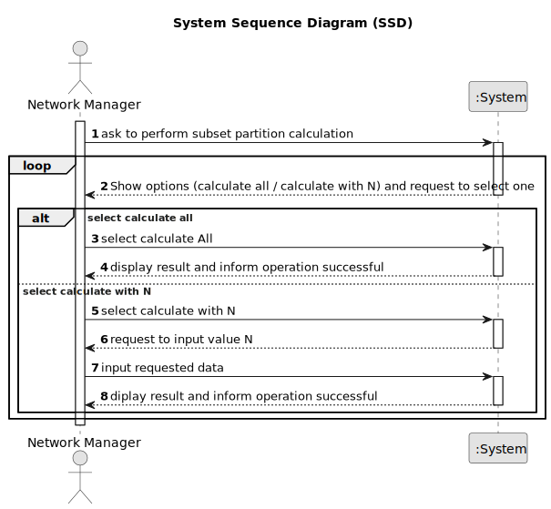

# US 019 - To perform partitions of cardinal 2  calculation on store

## 1. Requirements Engineering

### 1.1. User Story Description

As a network manager, I want to divide the set of all stores into two subsets,
so that the total number of properties of the stores between the two subsets is
the closest possible.    

### 1.2. Customer Specifications and Clarifications 

**From the specifications document:**

>	Each sublist should contain a set of tuples with two elements each, the storeID and the number of  properties manage by the store
**From the client clarifications:**

> **Question:**  NONE
>  
> **Answer:**  NONE

### 1.3. Acceptance Criteria

* **AC1:** The application should implement a brute-force algorithm, an algorithm
  which consists of calculating all the partitions of cardinal 2 and finding out which
  one is the minimum for the difference of the sum of the elements of each sublist.
* **AC2:** The algorithm should return the sublists of the partition (each sublist should
  contain a set of tuples with two elements each, the storeID and the number of
  properties manage by the store) that satisfies the stated condition and also the
  difference between the sums of the elements of the sublists. In the user manual,
  this algorithm must be written in pseudocode.
* **AC3:** Runtime tests for variable length n input lists, with com n = 3, 6, 9, …, 30
  (asymptotic behavior) should be performed. In each run the number of stores
  should be chosen sequentially. In the user manual, the results of measuring the
  time of each algorithm for one/several inputs of the same size, as also the graphic
  of the asymptotic behavior of the execution time should be presented (use a unit
  of time that allows you to distinguish the running times of all tested examples).
  Also, it should be presented the input list, the two sublists that make up the
  partition and difference of sums, for at least one example of each input size.
  administrator if the file is empty or its content is not in the requested format.
* **AC4:** . Worst-case time complexity of the algorithm should be documented in the
  application user manual (in the annexes, where algorithms should be written in
  pseudocode) that must be delivered with the application.
* 
### 1.4. Found out Dependencies

* Found Dependency on US012 (import Legacy System data)

### 1.5 Input and Output Data

**Input Data:**
N/A
* Typed data:
N/A

**Output Data:**

* Calculation Result
* (In)Success of the operation

### 1.6. System Sequence Diagram (SSD)

### 1.7 Other Relevant Remarks

* This US will use a specific csv file given by the client to perform analysis .