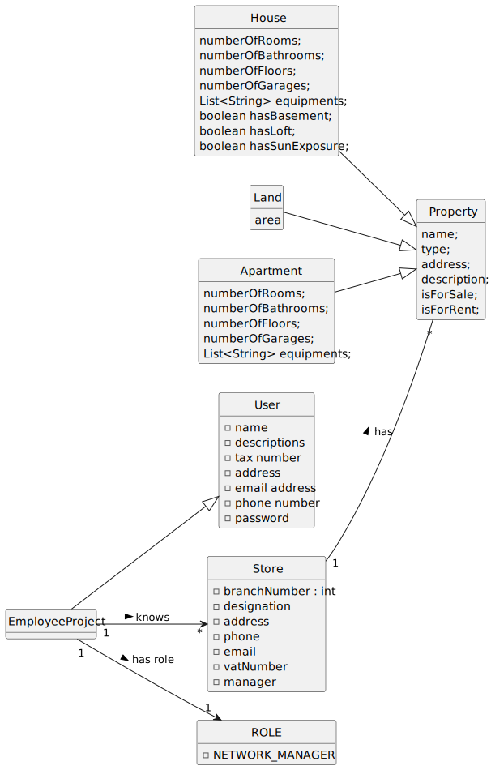

# US 019 - As a network manager, I want to divide the set of all stores into two subsets, so that the total number of properties of the stores between the two subsets is the closest possible.
## 2. Analysis

### 2.1. Relevant Domain Model Excerpt 

### 2.2. Other Remarks

N/A