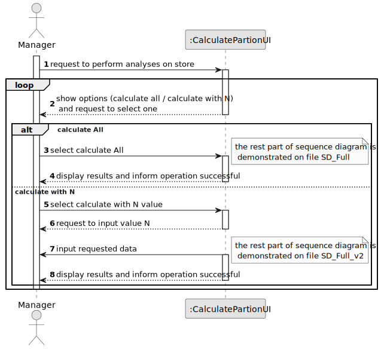
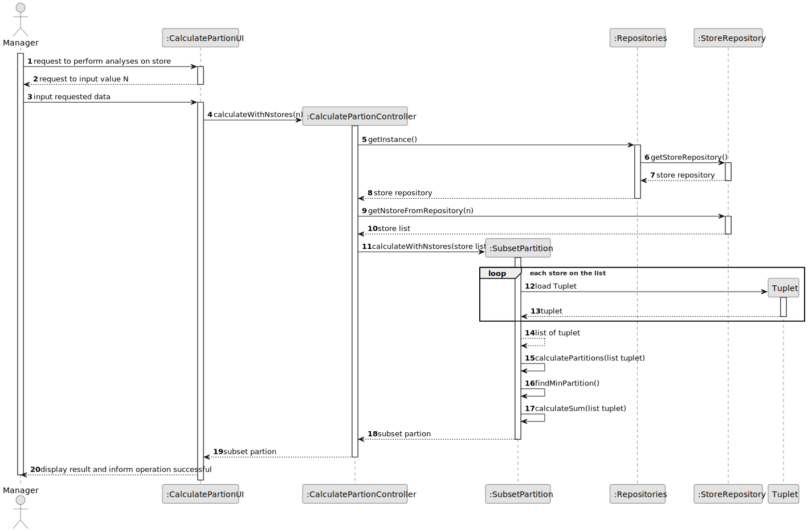

# US 012 - As a system administrator, I want to import information from a legacy system that has been in use in several agencies.

## 3. Design - User Story Realization 

### 3.1. Rationale

| Interaction ID | Question: Which class is responsible for...   | Answer                     | Justification (with patterns)                                                                                 |
|:---------------|:----------------------------------------------|:---------------------------|:--------------------------------------------------------------------------------------------------------------|
| Step 1  		     | 	... interacting with the actor?              | CalculatePartionUI         | Pure Fabrication: there is no reason to assign this responsibility to any existing class in the Domain Model. |
| 			  		        | 	... coordinating the US?                     | CalculatePartionController | Controller                                                                                                    |
| 			  		        | 	... knows datas of store?                    | StoreRepository            | IE: knows all informations of all stores                                                                      |
| 			  		        | 	... knows all repositories?                  | Repositories               | Repository knows Store Repository                                                                             |
| 			  		        | ... knowing property number for each store?   | Store                      | Store publishes a list of property                                                                            |
| 			  		        | ... knowing the user using the system?        | UserSession                | IE: cf. A&A component documentation.                                                                          |
| 			  		        | 							                                       | Manager                    | IE: knows its own data (e.g. email)                                                                           |
| Step 2  		     | 							                                       |                            |                                                                                                               |
| Step 3  		     | 	...perform analysis?                         | SubsetPartition                  | IE: to perform calculations                                                                                   |
| Step 4  		     | 	... informing operation success?             | CalculatePartionUI              | IE: is responsible for user interactions.                                                                     | 

### Systematization ##

According to the taken rationale, the conceptual classes promoted to software classes are: 

 * Store
 * SubsetPartition

Other software classes (i.e. Pure Fabrication) identified: 

 * CalculatePartionUI  
 * CalculatePartionController

## 3.2. Sequence Diagram (SD)

### Interaction with UI - Full Diagram

This diagram shows the full sequence of interactions between the actor involved in the realization of this user story and UI

### Option: Select calculate All - Full Diagram

This diagram shows the full sequence of interactions between the class involved when the manager selects option calculate all

### Option: Select calculate with N - Full Diagram

This diagram shows the full sequence of interactions between the class involved when the manager selects option calculate with N

## 3.3. Class Diagram (CD)

