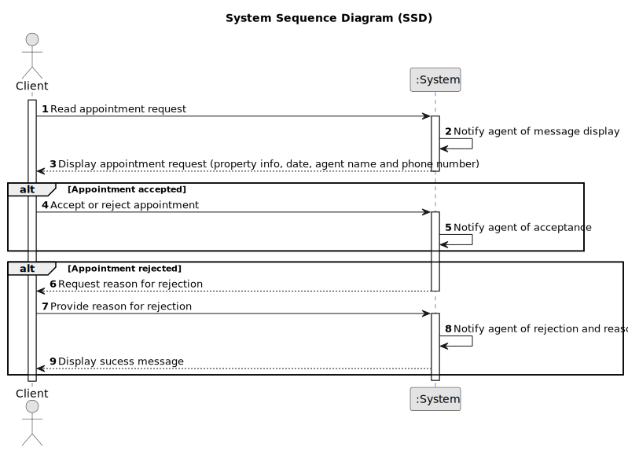

# US 020 - To List all employees of every store 

## 1. Requirements Engineering

### 1.1. User Story Description

As a client, I want to read the response for the appointment request, to accept or reject it.

### 1.2. Customer Specifications and Clarifications

**From the client clarifications:**

> **Question:**  Should the response for the booking request be displayed in the console? Or is it implied that the client saw the response in the email and knows what is being handled?
>  
> **Answer:** The agent must be notified by email when the message is displayed to the client.

> **Question:**  According to AC1, the agent must be notified when the message is displayed to the client. Should he receive an email?
> 
> **Answer:** The agent must be notified by email when the message is displayed to the client.

> **Question:**  When the agent rejects the visit request it doesn't make sense for the client to accept or reject that. What should be the options for the client in that case?
> 
> **Answer:** When the agent rejects the visit, the client should only acknowledge that he is aware of the agent's answer.

> **Question:**  The reason for declining the appointment should be selected from predefined options or entered as free text?
>
> **Answer:** The message should be entered as free text.

### 1.3. Acceptance Criteria

* **AC1:** The agent must be notified when the message is displayed to the client.
* **AC2:** The appointment request must provide information about the property and the date of the appointment.
* **AC3:** When the appointment is rejected, the client must specify the reason.
* **AC4:** The appointment request must provide the agent name and phone number.

### 1.4. Found out Dependencies

* There is a dependency to "US009 As a client, I want to leave a message to the agent to schedule a visit to a
  property of my interest." because the message is sent as a response to the appointment request.

### 1.5 Input and Output Data

**Input Data:**

* Typed data:
	* None
	
* Selected data:
	* None

**Output Data:**

* List of messages apointement request responses.

### 1.6. System Sequence Diagram (SSD)

**Other alternatives might exist.**

#### Alternative One

### 1.7 Other Relevant Remarks

* None