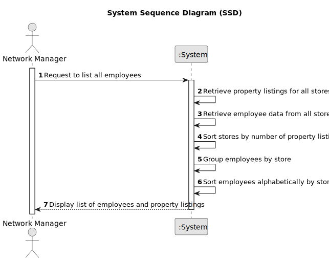

# US 013 - To List all employees of every store 

## 1. Requirements Engineering

### 1.1. User Story Description

As a network manager, I want to list all the employees working in every store of the network.

### 1.2. Customer Specifications and Clarifications 

**From the specifications document:**

>	Each task is characterized by having a unique reference per organization, a designation, an informal and a technical description, an estimated duration and cost as well as the its classifying task category. 

>	As long as it is not published, access to the task is exclusive to the employees of the respective organization. 

**From the client clarifications:**

> **Question:**  Do you want a list where the header is ID, the name of the store, and the total number of listings that the store has?
>  
> **Answer:** Yes.

### 1.3. Acceptance Criteria

* **AC1:** The list of employees should be alphabetically sorted and grouped by store
* **AC2:** Stores should be sorted according to their property listings, from the one with more listings to the one with less listings.
* **AC3:** Each store should state how many property listings it has.

### 1.4. Found out Dependencies

* There is a dependency to "US003 register a new employee"  and "US005 register a new store" since at least an employee and a store must exist to classify the task being created.

### 1.5 Input and Output Data

**Input Data:**

* Typed data:
	* None
	
* Selected data:
	* None

**Output Data:**

* List of existing employees

### 1.6. System Sequence Diagram (SSD)

**Other alternatives might exist.**

#### Alternative One

### 1.7 Other Relevant Remarks

* The created task stays in a "not published" state in order to distinguish from "published" tasks.