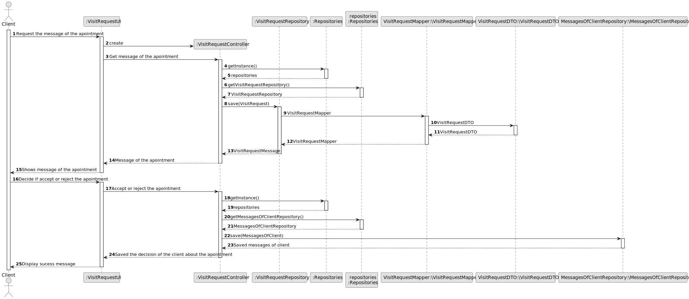
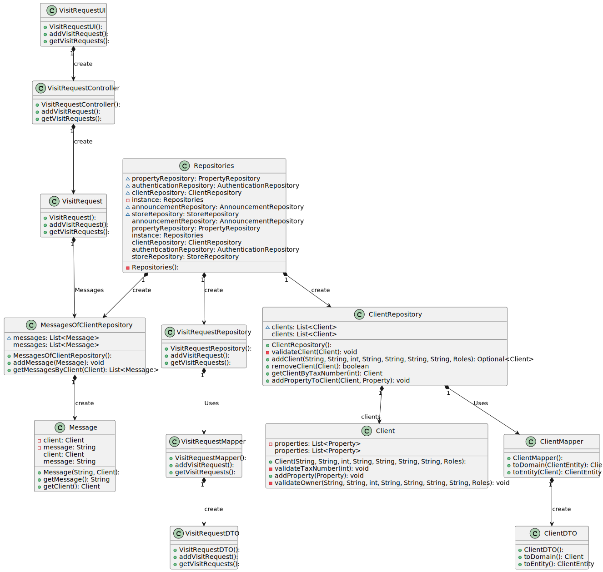

# US 020 - To respond to a visit request

## 3. Design - User Story Realization 

### 3.1. Rationale

**SSD - Alternative 1 is adopted.**

| Interaction ID | Question: Which class is responsible for...   | Answer                    | Justification (with patterns)                                                                                 |
|:---------------|:----------------------------------------------|:--------------------------|:--------------------------------------------------------------------------------------------------------------|
| Step 1  		     | 	... interacting with the actor?              | VisitRequestUI            | Pure Fabrication: there is no reason to assign this responsibility to any existing class in the Domain Model. |
| 			  		        | 	... coordinating the US?                     | VisitRequetController     | Controller                                                                                                    |
| 			  		        | 	... instantiating a new employee             | admin                     | Creator (Rule 1):  in the DM Store has employee..                                                             |
| Step 2  		     | 	...knowing the ListOfVisitRequests to show?  | VisitRequestRepository    | IE: knows all its stores                                                                                      |
| Step 3  		     | 		...knowing the ListOfMessages to show?      | MessageOfClientRepository | IE: knows all its employees                                                                                   |
| Step 4  		     | 	...knowing the properties of each store ?    | PropertyRepository        | IE: knows all properties.                                                                                     |
| Step 5 		      | 	... validating all data (local validation)?  | agent                     | IE: owns its data.                                                                                            | 
| 			  		        | 	... validating all data (global validation)? | StoreRepository           | IE: knows all its tasks.                                                                                      | 
| 			  		        | 	... saving the created task?                 | Organization              | IE: owns all its tasks.                                                                                       | 
| Step 6  		     | 	... Display List of Stores and Employees     | VisitRequestUI            | IE: is responsible for user interactions.                                                                     | 

### Systematization ##

According to the taken rationale, the conceptual classes promoted to software classes are: 

 * StoreRepository
 * PropertyRepository
 * VisitRequestRepository
 * MessageOfClientRepository
 * Agent
 * Organization

Other software classes (i.e. Pure Fabrication) identified: 

 * VisitRequestUI
 * VisitRequestController

## 3.2. Sequence Diagram (SD)

### Alternative 1 - Full Diagram

This diagram shows the full sequence of interactions between the classes involved in the realization of this user story.

### Alternative 2 - Split Diagram

This diagram shows the same sequence of interactions between the classes involved in the realization of this user story, but it is split in partial diagrams to better illustrate the interactions between the classes.

It uses interaction ocurrence.

## 3.3. Class Diagram (CD)

